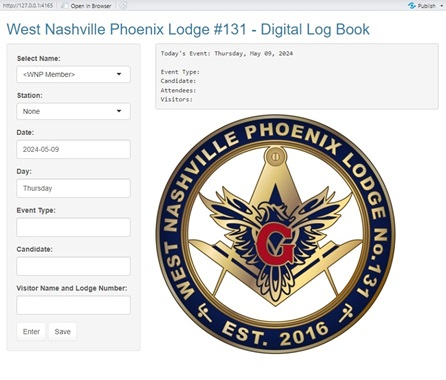

# Attendance Check-In App

This is an R-Shiny attendance check-in app, customized for use by masonic lodges. The app records meeting attendance to a spread sheet, allowing general metrics to be analyzed. Current meeting information is also printed to the screen so data entry can be confirmed. If the wrong candidate, or event information was entered, simply re-enter the information and the entries will be replaced.

## Recorded Information:
- Attendees with officer designations
- Visitor list (visitors can also indicate officer designation)
- Event type (e.g. MM Degree, SM, etc.)
- Candidate name

## Features:
- Auto-completion for the drop-down menu allows for rapid name selection 
- Date/day auto-detection

## Usage:
- "Enter" Button makes a new line entry in the temporary data frame from the currently displayed in the text input boxes. 
- Multiple text fields can be entered simultanesously.
- Visitors can have officer stations 
- "Save" button: saves the currently entered information as a new column in the initial spread sheet. There should be no problem clicking save multiple times as the app will simply over-write the current day's column. So, if a member arrives late, it's perfectly fine to add them and click save again. This button also makes a bakup copy of the updated attendance data with the name [current date]_[originalFileName].csv.
- The attendance data can also be manually edited in Excel, e.g. to add/remove members.  

## Notes:
- To use auto-complete in the member drop-down menu, click the drop down menu, hit "delete", then start typing. 
- Data are stored as a .csv file. As such, avoid the use of commas in entry fields. The app does not currently remove entered commas, so disrupt the data structure.

# Future versions:
- There is no ability to remove accidentally entered attendees or visitors
- Text entries should be filtered to remove commas, preventing issues with .csv formatted data